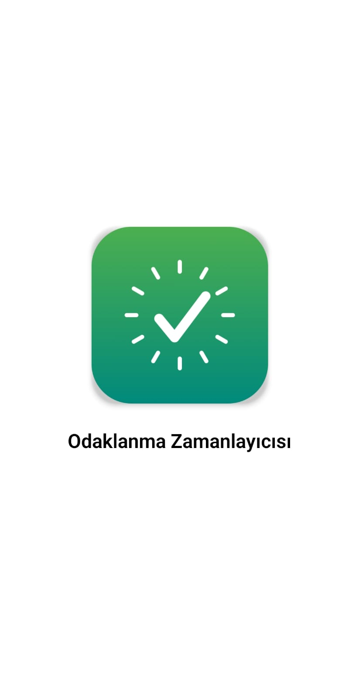
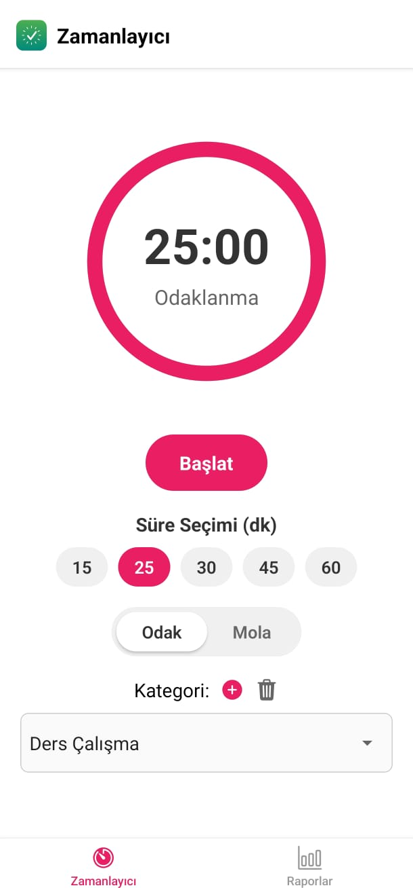
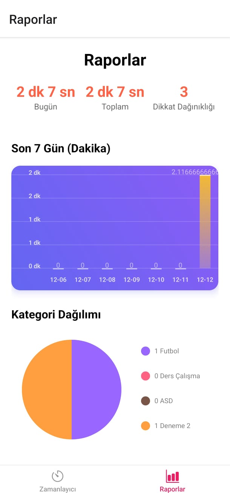
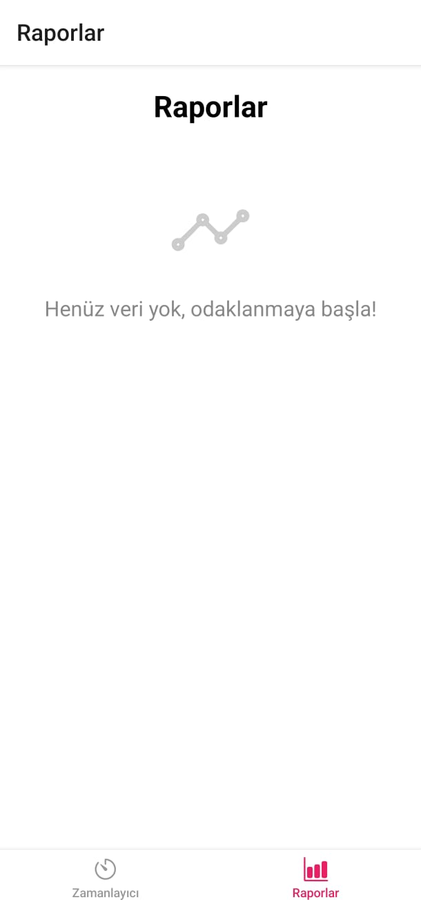
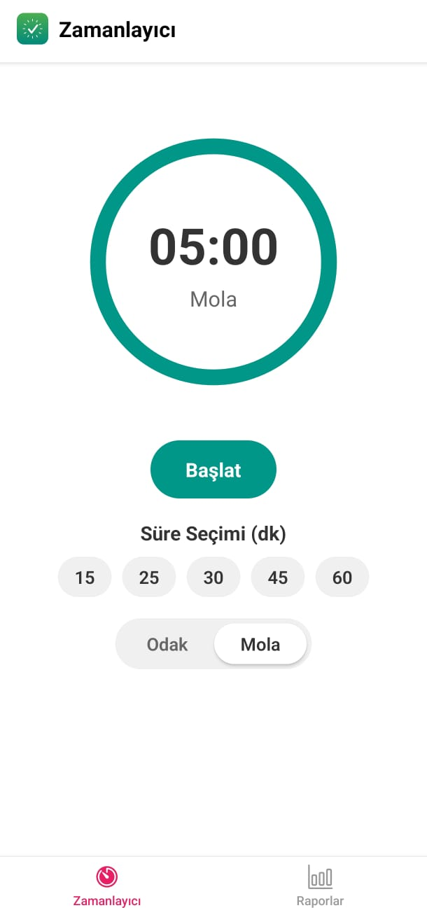
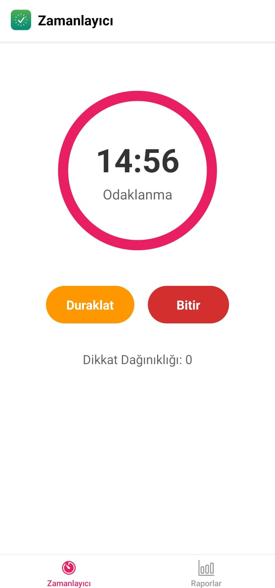
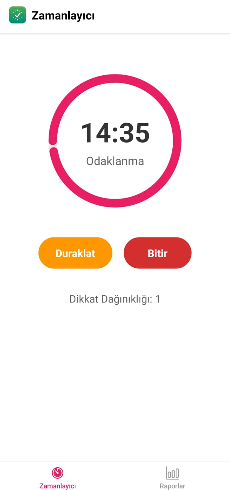
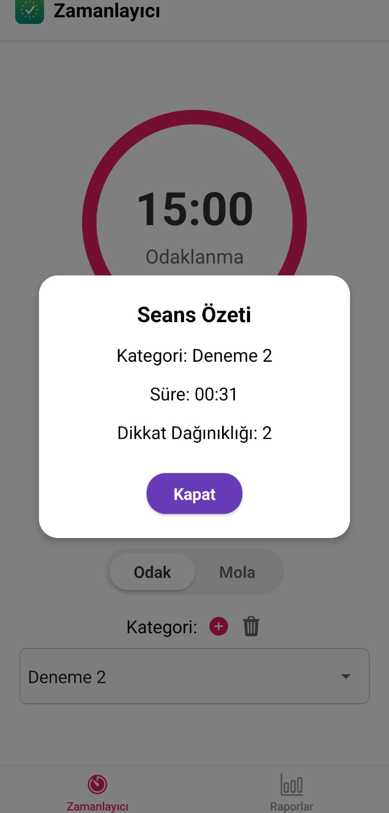

# Odaklanma Zamanlayıcısı (Focus Tracking App)

Odaklanma ve mola oturumlarınızı takip etmenize, kategori bazlı kayıt tutmanıza ve grafiklerle ilerlemenizi görselleştirmenize yardımcı olan bir React Native (Expo) uygulaması.

---

## İçindekiler
- [Proje Hakkında](#proje-hakkında)
- [Ekran Görüntüleri](#ekran-görüntüleri)
- [Özellikler](#özellikler)
- [Ekranlar](#ekranlar)
- [Mimari ve Dosya Yapısı](#mimari-ve-dosya-yapısı)
- [Kurulum ve Çalıştırma](#kurulum-ve-çalıştırma)
- [Kullanım](#kullanım)
- [Veri Saklama ve Model](#veri-saklama-ve-model)
- [Bağımlılıklar](#bağımlılıklar)
- [Geliştirme Notları ve İzinler](#geliştirme-notları-ve-izinler)
- [Yol Haritası / Geliştirme Önerileri](#yol-haritası--geliştirme-önerileri)

---

## Proje Hakkında

Uygulama, Pomodoro benzeri odak oturumlarını başlatma/duraklatma/bitirme akışı sağlar. Odak ve Mola modları arasında geçiş yapılabilir. Odak oturumları bittiğinde veya erken bitirildiğinde oturum özeti kaydedilir. Geçmiş oturumlar, günlük ve toplam süre istatistikleri, dikkat dağınıklığı sayıları ve kategori dağılımı grafiklerle sunulur.

---

## Ekran Görüntüleri

Aşağıda uygulamanın farklı ekranlarından görüntüler yer almaktadır.

### 🚀 Uygulama Açılış Ekranı (Splash Screen)
Uygulama başlatıldığında kullanıcıyı karşılayan yükleme ekranı. Yeşil gradient arka plan üzerinde uygulama logosu ve adı görüntülenir.


<p align="center">
  
</p>

---

### ⏱️ Ana Zamanlayıcı Ekranı
Uygulama açıldıktan sonra karşınıza çıkan ana ekran. Çember şeklinde ilerleme göstergesi, süre seçimi butonları (15/25/30/45/60 dakika), Odak/Mola mod değiştirici ve kategori seçimi bu ekranda yer alır.


<p align="center">
  
</p>

---

### 📊 Raporlar Sayfası (Veri Mevcut)
Odaklanma oturumlarınızın kaydedildiği istatistik ekranı. Bugünkü ve toplam odaklanma süreleri, dikkat dağınıklığı sayısı, son 7 günün bar grafiği ve kategori bazlı pasta grafik görüntülenir.


<p align="center">
  
</p>

---

### 📭 Raporlar Sayfası (Veri Yok)
Henüz hiçbir odaklanma oturumu kaydedilmediğinde görüntülenen ekran. Kullanıcıyı odaklanmaya teşvik eden bir mesaj gösterilir.


<p align="center">
  
</p>

---

### ☕ Mola Zamanlayıcısı
Mola moduna geçildiğinde görüntülenen ekran. Yeşil/turkuaz renk temasıyla odak modundan ayrışır. Mola süreleri için varsayılan 5 dakika olarak ayarlanmıştır.


<p align="center">
  
</p>

---

### 🔔 Dikkat Dağınıklığı Takibi
Odaklanma oturumu sırasında uygulamadan çıkıldığında dikkat dağınıklığı sayacı otomatik olarak artar. Bu özellik, kullanıcının ne kadar odaklı kaldığını takip etmesine yardımcı olur.

<table>
  <tr>
    <th align="center">Uygulamadan Çıkmadan Önce (0)</th>
    <th align="center">Uygulamadan Çıktıktan Sonra (1)</th>
  </tr>
  <tr>
    <td align="center"></td>
    <td align="center"></td>
  </tr>
</table>

*Sol tarafta dikkat dağınıklığı sayacı 0 iken, sağ tarafta uygulamadan çıkıp geri dönüldükten sonra sayaç 1'e yükselmiştir.*

---

### 📋 Seans Özeti
Odaklanma oturumu tamamlandığında veya manuel olarak bitirildiğinde açılan özet penceresi. Kategori bilgisi, toplam süre ve dikkat dağınıklığı sayısı burada görüntülenir.

<p align="center">
  
</p>

---

### ➕ Kategori Ekleme
Yeni kategori oluşturma penceresi. Kategori adı girilir ve 12 farklı renk seçeneğinden biri seçilerek kişiselleştirilmiş kategoriler oluşturulabilir.

<p align="center">
  
</p>

---

## Özellikler
- Odak ve Mola modları arasında geçiş.
- Süre seçimi (15/25/30/45/60 dk) ve mod bazlı varsayılanlar (Odak: 25 dk, Mola: 5 dk).
- Çember ilerleme göstergesi (progress ring) ile kalan süre görselleştirme.
- Uygulama arka plana atıldığında otomatik duraklatma ve dikkat dağınıklığı sayacı artışı.
- Odak oturumu sonunda titreşimle bildirim ve oturum özeti.
- Kategori yönetimi: varsayılan kategoriler, kategori ekleme/silme, seçili kategori ile oturum kaydı.
- Raporlar ekranında:
  - Bugün ve toplam dakika istatistikleri,
  - Son 7 güne ait bar grafik (dakika),
  - Kategorilere göre pasta grafik,
  - Geçmiş oturum listesi ve tekil kayıt silme.
- Yerel depolama (AsyncStorage) ile kalıcı veri saklama.
- Safe area desteği ve alt sekme navigasyonu.

## Ekranlar

### Zamanlayıcı (HomeScreen)
- Sayaç başlat/duraklat/bitir kontrolleri.
- Süre seçimi butonları ve mod (Odak/Mola) değişimi.
- Odak modunda kategori seçimi, kategori ekleme/silme.
- Oturum bitince özet modalı (kategori, süre, dikkat dağınıklığı).

### Raporlar (ReportsScreen)
- Bugün/toplam dakika ve toplam dikkat dağınıklığı istatistikleri.
- Son 7 gün dakika dağılımı için bar grafik.
- Kategori bazlı süre dağılımı için pasta grafik.
- Geçmiş oturum listesi, tekil kayıt silme.

## Mimari ve Dosya Yapısı


- `App.js`: Tab tabanlı navigasyon, `Zamanlayıcı` ve `Raporlar` sekmeleri; başlıkta SVG Logo.
- `app.json`: Expo uygulama yapılandırması (ad, ikon, splash, platform ayarları, `expo-asset` plugin).
- `src/components/Logo.js`: `react-native-svg` ile gradient arka planlı, halka ve onay işareti içeren logo.
- `src/hooks/useFocusTimer.js`: Sayaç durumu, mod yönetimi, arka plan davranışı ve titreşim.
- `src/screens/HomeScreen.js`: Zamanlayıcı UI, kategori yönetimi, oturum özeti modalı.
- `src/screens/ReportsScreen.js`: İstatistikler, grafikler ve geçmiş oturumlar.
- `src/utils/storage.js`: AsyncStorage ile oturum ve kategori saklama/okuma/silme.
- `assets/`: İkon ve splash görselleri.

## Kurulum ve Çalıştırma

Projeyi yerel ortamınızda çalıştırmak ve geliştirmek için aşağıdaki adımları izleyin.

### Önkoşullar
- **Node.js (LTS sürümü)**: Bilgisayarınızda yüklü olmalıdır.
- **Paket Yöneticisi**: Node.js ile gelen `npm` veya alternatifi `yarn`.
- **Expo Go Uygulaması**: Projeyi fiziksel telefonunuzda test etmek için App Store (iOS) veya Google Play (Android) mağazasından indirin.
- **Emülatör (Opsiyonel)**: Bilgisayarınızda sanal cihaz çalıştırmak isterseniz Android Studio veya Xcode (sadece macOS) gereklidir.

### Kurulum Adımları

1. **Projeyi Klonlayın:**
   Terminali açın ve projeyi bilgisayarınıza indirin (veya ZIP olarak indirip çıkarın):
   ```bash
   git clone https://github.com/talhakenan1/mobilODev.git
   cd mobilODev
   ```

2. **Bağımlılıkları Yükleyin:**
   Proje klasörü içerisindeyken gerekli paketleri yükleyin:
   ```bash
   npm install
   ```

### Uygulamayı Çalıştırma

Geliştirme sunucusunu başlatmak için şu komutu kullanın:
```bash
npm start
# veya alternatif olarak: npx expo start
```

Komutu çalıştırdıktan sonra terminalde bir QR kod ve işlem menüsü göreceksiniz:

- **Fiziksel Cihazda (Önerilen):**
  - Telefonunuzdaki **Expo Go** uygulamasını açın.
  - QR kodunu taratın (Android için uygulama içinden, iOS için kamera uygulamasından).
  - Uygulama telefonunuza yüklenecek ve çalışacaktır.

- **Emülatörlerde:**
  - **Android:** Terminalde `a` tuşuna basın (Android emülatörü açık olmalıdır).
  - **iOS:** Terminalde `i` tuşuna basın (Xcode ve iOS Simülatörü gereklidir).
  - **Web:** Terminalde `w` tuşuna basın (Bazı özellikler webde kısıtlı olabilir).

### Sorun Giderme
- **Bağlantı Hatası:** "Network response timed out" hatası alırsanız, telefon ve bilgisayarın **aynı Wi-Fi** ağında olduğundan emin olun.
- **Tünel Bağlantısı:** Farklı ağlardaysanız `npx expo start --tunnel` komutunu deneyebilirsiniz.

## Kullanım

1. `Zamanlayıcı` sekmesinde süre ve mod seçin.
2. Odak modunda bir kategori seçin veya ekleyin.
3. `Başlat` ile sayaç çalıştırın; `Duraklat` ile duraklatın; `Bitir` ile oturumu sonlandırın.
4. Oturum sonlarında açılan özet modaldan bilgileri görüntüleyin.
5. `Raporlar` sekmesinden günlük/toplam istatistikleri, son 7 günü ve kategori dağılımını takip edin; gerekirse tekil oturumları silin.

## Veri Saklama ve Model

AsyncStorage anahtarları:
- `@focus_sessions`: Oturum listesi.
- `@focus_categories`: Kategori listesi.

Oturum nesnesi örneği (`src/utils/storage.js`):
```
{
  id: string,               // otomatik: Date.now().toString()
  date: string,             // ISO tarih
  duration: number,         // planlanan süre (saniye)
  elapsed: number,          // gerçekleşen süre (saniye)
  category: string,         // seçili kategori
  distractions: number      // dikkat dağınıklığı sayısı
}
```

Kategori yönetimi:
- Varsayılanlar: `Ders Çalışma`, `Kodlama`, `Proje`, `Kitap Okuma`.
- Ekle/sil işlemleri `HomeScreen` üzerinden yapılır ve AsyncStorage’a kaydedilir.

Kaydetme davranışı:
- Sadece `Odak` modundaki oturumlar kaydedilir.
- Oturum tamamlanınca veya manuel bitirilince özet modalı açılır ve kayıt yapılır.

## Bağımlılıklar

`package.json` başlıca bağımlılıklar:
- `expo`, `react`, `react-native`
- `@react-navigation/native`, `@react-navigation/bottom-tabs`
- `react-native-safe-area-context`, `react-native-screens`
- `@react-native-async-storage/async-storage`
- `@react-native-picker/picker`
- `react-native-svg`
- `expo-keep-awake`, `expo-av`, `expo-status-bar`, `expo-asset`
- `react-native-chart-kit`

## Geliştirme Notları ve İzinler

- Titreşim: `Vibration` API kullanılır; cihazda titreşim iznine gerek olmadan çalışır.
- Arka plan davranışı: `AppState` ile arka plana geçildiğinde sayaç duraklatılır ve `distractions` artırılır.
- Ses uyarısı: `expo-av` üzerinden ses çalma örneği yer alır; varsayılan olarak titreşim kullanılır.
- Ekranı açık tutma: `expo-keep-awake` ile odak sırasında ekran kapanmaz.

